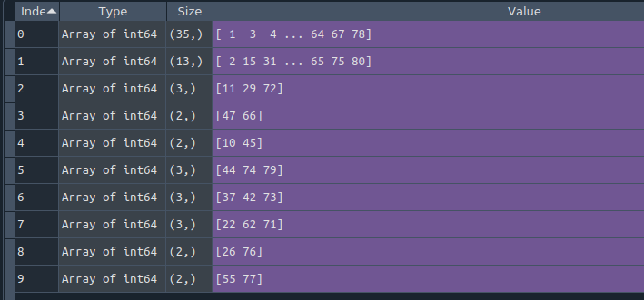

# Automated spike sorting curation

This repository contains the code of automated spike sorting curation, recently presented as “Multi-channel automated spike sorting achieves near-human performance”, in FENS forum 2022, Paris, France, July 2022.

https://github.com/EranStarkLab/AutomatedCurator

## Overview

Identifying spike timing of individual neurons recorded simultaneously is essential for investigating the neuronal circuits that underlie cognitive functions. Recent developments allow the simultaneous recording of multi-channel extracellular spikes from hundreds of neurons. Yet classifying extracellular spikes into putative source neurons remains a challenge. 
Here, we set out to develop a fully automated algorithm which can replace manual curation for an existing multi-channel spike sorting solution. As an input to the automated curator (AC), we use [KlustaKwik](https://github.com/klusta-team/klustakwik) to over-cluster the spikes automatically, yielding numerous spike clusters. From that point onwards, we refer to spike sorting not as a clustering problem, but rather as a sequence of two binary classification problems. To perform automatic curation, we first use a “noise classifier” to remove non-neuronal clusters. Second, we use a “merge classifier” to determine whether any given pair of clusters should be merged. The output of the AC is a set of well-isolated units.

## Requirements

Dataset:
The input for the automated curator should be a dataset in a [neurosuite](https://neurosuite.sourceforge.net/) format (Hazan et al., 2006). Specifically, the following three files are required:
- clu: spike labels, e.g. session_name.clu.1 
- res: spike times in samples, e.g. session_name.res.1
- spk: spike waveforms, e.g. session_name.spk.1  

The current version of the AC works only with data which were recorded at 20 kHz, and spike waveforms which are 32 samples long.

### Operating system:
The code was tested on machines running Linux (Ubuntu 18), but is expected to work on any OS

### Prerequisites
-	Conda (both Miniconda and Anaconda are fine)
-	Python>3.6

## Installation
For installing the automated curator, first create an activate a virtual environment using conda:
```
$ conda create --name myenv
$ conda activate myenv
```
Second, install the [FastAi](https://docs.fast.ai/) package, if you are using Miniconda run: 
```
conda install -c fastchan fastai
```
or if you are using Anaconda then run:
```
conda install -c fastchan fastai anaconda
```

Third, install the [Phylib](https://github.com/cortex-lab/phylib) package with pip:
```
$  pip install phylib
```

Finally, clone the repository to your machine:
```
$ git clone https://github.com/EranStarkLab/Automated-curation.git
```

## Running the automated curator 
### Running the automated curator using Python IDE
-	Open the running_AC_pipeline.py file in your Python IDE
-	Change lines 24-26 according to your dataset which you want to curate
-	Run the running_AC_pipeline.py script
### Running the automated curator using bash (Linux/mac OS):
-	Navigate to the automated curator folder
```
$ cd filebase/to/automated/curator/folder
```
-	Activate conda virtual environment
```
$ conda activate myenv
```
-	Run the automated curator script with three inputs:
1.	Filebase: full path to session dataset with session name, e.g. ~/home/data/session_name
2.	shank_number: shank number, e.g. 1
3.	n_channels: number of channels in the spk file, e.g 10 
```
$ python running_AI_pipeline_bash.py Filebase n_shanks n_channels
```

## Automated curator output
The output of the automated curator is a list of lists. Every list is a recommendation for an action, that can be carried out in the environment of [klusters](https://neurosuite.sourceforge.net/). The first list (index 0) contains the “Noise/Multi-units”, clusters which are either non-neuronal units or multi-neuronal units which cannot be separated into single units. Every other list (index 1 and higher) contains two or more units which should be merged with one another.


